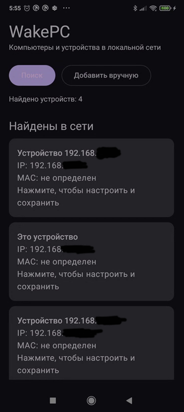
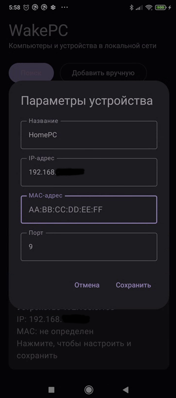

# WakePC

Android-приложение для поиска устройств в локальной сети и включения компьютеров с помощью Wake-on-LAN.

## Возможности

- поиск доступных устройств в локальной сети;
- определение IP-адреса и имени устройства, если оно доступно через DNS;
- добавление и редактирование названия, IP, MAC-адреса и UDP-порта;
- автоматическое форматирование MAC-адреса;
- сохранение настроенных устройств между запусками;
- отправка Wake-on-LAN magic packet по UDP;
- стандартный WoL-порт `9`.

## Скриншоты

<!-- Добавьте скриншоты в docs/screenshots и замените блоки ниже. -->

### Главный экран

### Поиск устройств

### Настройка устройства

## Технологии

- Kotlin
- Jetpack Compose
- Kotlin Coroutines
- UDP / Wake-on-LAN

## Важно!

> Эмулятор Android может не передавать UDP broadcast в физическую домашнюю сеть. Wake-on-LAN должен быть включен в BIOS/UEFI и настройках сетевой карты компьютера.
